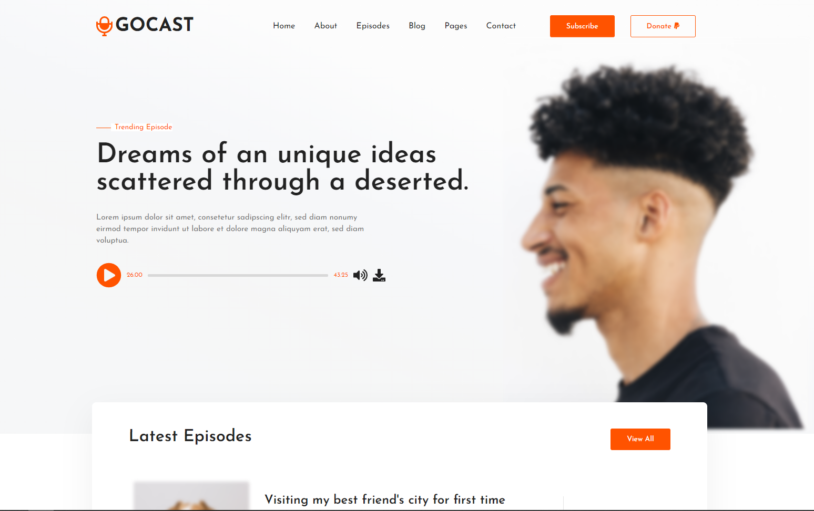

# GoCast - Podcast website 
Implementation of live podcast website with Gatsby.js from free Adobe XD design template by [themefisher](https://dribbble.com/themefisher)



## General info
GoCast is a fictional website for hosting podcasts. Goal of this project was to build working example of converting design file to live website. Project was built for training and learning new technologies.

## Technologies
Project was built with:
* React.js v16
* Gatsby v2

## Setup
To run project, install it localy using npm: 
```
$ cd gocast
$ npm install
$ npm run start
```

## Project status
Project is still in development phase. Some parts are not yet functional (like mobile menu, links to blog posts...). It will be announced here, when project is finished.

Live demo: https://gocast.surge.sh
